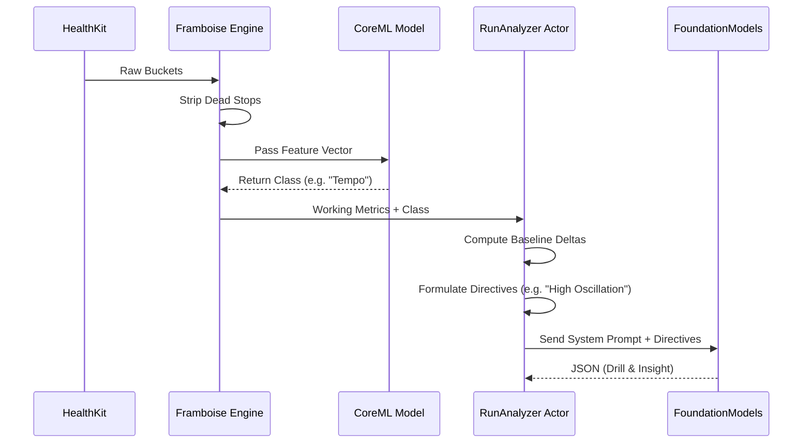

# AI & CoreML Pipeline

Runalyst V2 employs a hybrid intelligence pipeline. It uses traditional deterministic math, offline-trained CoreML, and on-device Generative AI to provide coaching insights. This prevents LLM hallucinations (by offloading math to Swift) and improves response latency.

## Pipeline Architecture



## 1. The CoreML Classifier
The `RunalystClassifier.mlmodel` is an offline-trained tabular classification model. It categorizes the overall effort of the run.

### Training the Model
We do not train the model directly in the app or via GitHub Actions. Instead, we generate synthetic data to feed into Apple's Create ML:
1. `generate_seed_runs.py` produces a CSV containing thousands of synthetic runs with balanced classes.
2. The developer downloads `CoreML_Training_Data_v3.csv` from GitHub Actions.
3. Using Xcode's **Create ML**, the developer trains a tabular classifier targeting the `targetClass` column.
4. The exported `.mlmodel` is committed back to the repository.

**Future Code Context**: If you introduce a new feature (like `runningPower`), you must add it to `generate_seed_runs.py`, regenerate the CSV, retrain the model in Create ML, and update the `RunalystClassifierInput` inside `ModelManager.swift`.

## 2. Deterministic Directives
FoundationModels are poor at math. We do all math in Swift (`FramboiseEngine`). If a user's cadence dropped by 10 SPM and their vertical oscillation increased by 3 cm, `RunAnalyzerActor` calculates this exactly.

**Future Code Context**: Never ask the LLM to calculate a delta. Instead, compute the delta in Swift, and inject a strict textual directive into the prompt: `"DIRECTIVE: The user's cadence dropped by 10 SPM. Prescribe Cadence Pyramids."`

## 3. FoundationModels Generation
The generative AI uses the `LanguageModelSession` (iOS 26+). It maps the deterministic directives into a conversational tone.

### The `@Generable` Schema
We use Swift's macro system to enforce structured output.
```swift
@Generable
struct CoachingInsightPayload {
    var drillTitle: String
    @Guide(description: "Max 3 sentences. Tone must be highly conversational.")
    var insightBody: String
}
```

**Future Code Context**: 
- **Apple TN3193 Limits**: The underlying on-device models have strict 4,096-token limits. Do not use generic JSON strings. Use `@Generable` to leverage Apple's native schema packing.
- **Prompt Constraints**: If the model frequently hallucinates a field, do not write a massive paragraph in the system prompt. Instead, use a `@Guide(description:)` directly on the struct property to heavily constrain the generation space for that specific field.
