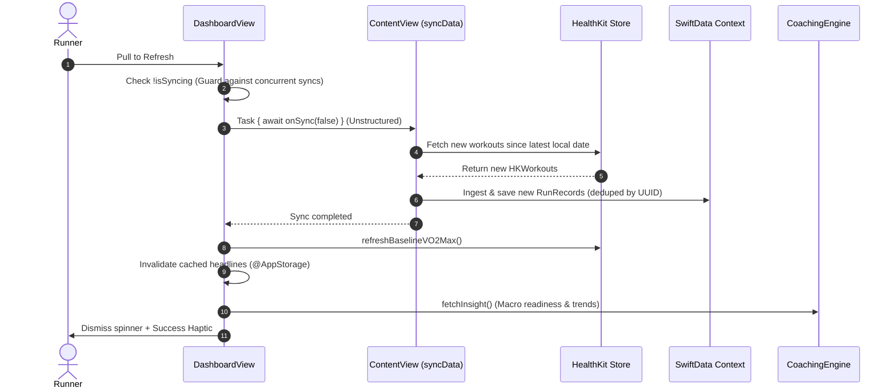

# 5. Dual-Scope Refresh and HealthKit Synchronization Lifecycle

* **Status**: Proposed
* **Date**: 2026-09-24
* **Deciders**: Runalyst Engineering Team
* **Consulted**: Architecture & Data Engineering Working Group
* **Informed**: Runalyst Core Contributors

## Context and Problem Statement

Runalyst is a local-first iOS application that bridges HealthKit workout data, custom biomechanical analysis engines (`FramboiseEngine`), and on-device AI coaching (`CoachingEngine` / `RunAnalyzerActor`). 

A major usability and architectural discrepancy exists between what users expect when using SwiftUI's pull-down-to-refresh gesture and what the system currently executes:

1. **Dashboard Refresh Skips HealthKit**: Pulling down to refresh on `DashboardView` (`DashboardView.swift:1163`) currently clears the `@AppStorage` headline text cache and re-prompts the macro LLM (`fetchInsight()`), but **does not trigger HealthKit data synchronization** (`onSync`). If a runner finishes a workout on their Apple Watch while Runalyst is backgrounded, pulling to refresh on the dashboard does nothing to import the new run. HealthKit sync is only triggered during view initialization (`.task`).
2. **Missing Baseline Recalculation on Dashboard**: `refreshBaselineVO2Max()` is called on `.task` launch but omitted from `.refreshable`.
3. **The "All-or-Nothing" Re-Ingestion Dilemma**: On `RunDetailView` (`RunDetailView.swift:590`), pull-down-to-refresh re-prompts the AI coaching model with `force: true`. However, it operates exclusively on previously persisted scalars. If new quantity types are added to the ingestion engine (e.g., Stride Length in [ADR 0004](0004-stride-length-biomechanical-analysis.md)) or if run classification algorithms are revised (e.g., Topological Signature Classification in [ADR 0003](0003-topological-signature-classification-for-run-types.md)), the user has no way to refresh a single workout from HealthKit. Their only recourse is the "Resync Health Data & Rebuild AI Insights" button in `SettingsView`, which nukes the entire SwiftData SQLite database, destroys user action history, and forces minutes of sequential LLM re-analysis.
4. **SwiftUI Task Cancellation Vulnerability**: As documented in `AGENTS.md`, SwiftUI `.refreshable` cancels its internal cooperative task if the view hierarchy re-renders during state mutations. Synchronous HealthKit queries and SQLite saves placed directly inside `.refreshable` risk mid-flight aborts.

## Decision Drivers

* **User Mental Model Parity**: Pulling down on the dashboard must check for new workouts and update readiness; pulling down on a specific run must re-query that run's raw metrics and refresh its coaching.
* **Granular Backfilling Without Database Wipes**: Allow individual workouts to incorporate newly supported metrics (like Stride Length or topological classifications) via single-record re-ingestion without resetting user history.
* **Preservation of User-Edited State**: Protect manual user classifications (`TrainingCorrection`), user drill associations, and completed drill states during any re-ingestion.
* **Non-Blocking UI Spinners**: Do not hold the pull-to-refresh UI spinner hostage while on-device LLMs process multi-run queues.
* **Cancellation and Concurrency Safety**: Wrap long-running operations in detached or unstructured tasks per `AGENTS.md` to prevent view re-render cancellations. Guard against race conditions using `isSyncing`.

## Considered Options

* **Option 1 (Dual-Scope Refresh Architecture: Macro Incremental Sync + Targeted Micro Re-Ingestion)**:
  - **Macro Scope (`DashboardView`)**: Guard against `isSyncing` $\rightarrow$ trigger incremental HealthKit workout ingestion via unstructured task $\rightarrow$ refresh VO2 Max baseline $\rightarrow$ invalidate headline cache $\rightarrow$ generate fresh macro readiness insight.
  - **Micro Scope (`RunDetailView`)**: Query HealthKit for that specific `hkWorkoutID` $\rightarrow$ extract all sample streams (including stride length) $\rightarrow$ re-run `FramboiseEngine` working stats and topological classifier $\rightarrow$ update SwiftData in-place $\rightarrow$ trigger single-run AI coaching.
* **Option 2 (Prompt-Only Refresh + Settings Resync Only - Status Quo)**:
  - Keep pull-to-refresh restricted to re-prompting the LLM with existing scalar data; require users to wipe the entire database in Settings to update any HealthKit metrics or classifications.
* **Option 3 (Full Historical Scan on Dashboard Pull)**:
  - Trigger a full historical re-sync and re-analysis of all runs whenever the dashboard is refreshed. (Rejected: severely violates the "Zero Redundant Compute & Repairs" rule in `AGENTS.md`, causing thermal throttling and battery drain).

## Decision Outcome

Chosen option: **Option 1 (Dual-Scope Refresh Architecture)**, because it aligns user intuition with system behavior, provides non-destructive single-run backfills, and respects device thermal and battery constraints.

---

## Technical Specification & Architecture

### 1. Macro Scope Lifecycle (`DashboardView.swift`)

When the user pulls down on the dashboard:



#### Implementation Rules for Macro Scope
1. **Unstructured Task Safety**: Invoke `onSync` inside an unstructured `Task { ... }` so SwiftUI re-renders do not trigger `CancellationError` mid-sync:
   ```swift
   .refreshable {
       guard !isSyncing else { return }
       isSyncing = true
       Task {
           do {
               if let onSync {
                   await onSync(false)
               }
               refreshBaselineVO2Max()
               sanitizeSpuriousDrillTags()
               cachedHeadline7Day = ""
               cachedBody7Day = ""
               cachedHeadline30Day = ""
               cachedBody30Day = ""
               fetchInsight()
               UINotificationFeedbackGenerator().notificationOccurred(.success)
           }
           isSyncing = false
       }
   }
   ```
2. **Spinner Decoupling**: The pull-to-refresh spinner dismisses once `onSync` commits new runs to SwiftData and kicks off `fetchInsight()`. If multiple newly imported runs require on-device LLM generation, they continue sequentially in the background through `RunAnalyzerActor` with 5s pacing delays.

---

### 2. Micro Scope Lifecycle (`RunDetailView.swift`)

When the user pulls down on an individual run detail screen:

```mermaid
sequenceDiagram
    autonumber
    actor Runner
    participant Detail as RunDetailView
    participant HKManager as HealthKitManager
    participant HK as HealthKit Store
    participant Engine as FramboiseEngine
    participant SwiftData as SwiftData Context
    participant Actor as RunAnalyzerActor

    Runner->>Detail: Pull to Refresh
    Detail->>HKManager: refreshWorkoutMetrics(for: runRecord)
    HKManager->>HK: Query HKWorkout where UUID == runRecord.hkWorkoutID
    HK-->>HKManager: Return HKWorkout & quantity series
    HKManager->>Engine: Recompute 30s buckets, working stats & topological classification
    Engine-->>HKManager: Working stats, Stride Length, VR, and Classification
    HKManager->>SwiftData: Mutate runRecord in-place & save
    Detail->>Actor: generateAnalysis(for: runRecord.persistentModelID, force: true)
    Actor->>Actor: Recompute 30-day baseline relative to run.date
    Actor->>Detail: Updated CoachingInsight & Drills rendered
    Detail->>Runner: Dismiss spinner + Success Haptic
```

#### New Ingestion API on `HealthKitManager`
Add targeted single-run re-ingestion to `HealthKitManager.swift`:

```swift
func refreshWorkoutMetrics(for record: RunRecord, context: ModelContext) async throws {
    guard let workout = try await fetchWorkout(by: record.hkWorkoutID) else {
        throw HKError(.errorNoData)
    }
    
    // 1. Fetch full quantity streams (HR, Pace, Cadence, Oscillation, Stride Length)
    let samples = try await fetchSamples(for: workout)
    
    // 2. Re-run FramboiseEngine bucketing and topological signature classification
    let workingStats = FramboiseEngine.calculateWorkingAverages(from: samples, workout: workout)
    let detectedType = FramboiseEngine.classifyRun(buckets: workingStats.buckets, ...)
    
    // 3. Update record in-place (preserving manual corrections)
    if record.manualCorrection == nil {
        record.detectedTypeRaw = detectedType
    }
    record.workingAvgPace = workingStats.workingAvgPace
    record.workingAvgCadence = workingStats.workingAvgCadence
    record.workingAvgHeartRate = workingStats.workingAvgHeartRate
    record.rawAvgStrideLength = workingStats.rawAvgStrideLength
    record.workingAvgStrideLength = workingStats.workingAvgStrideLength
    record.rawAvgVerticalOscillation = workingStats.rawAvgOscillation
    record.workingAvgVerticalOscillation = workingStats.workingAvgOscillation
    
    try context.save()
}
```

---

## Positive Consequences

* **Intuitive Dashboard Behavior**: Pulling down on the dashboard immediately pulls in runs logged on other devices or Apple Watch during the session.
* **Targeted Recovery from Schema/Algorithm Updates**: When new metrics (like Stride Length in ADR 0004) or new classifiers (like Topological Signatures in ADR 0003) are released, users can refresh specific older runs on demand without wiping their entire app history.
* **User Data Preservation**: User-specified training corrections and completed drill records remain intact.
* **Thermal & Battery Protection**: Preserves the zero-launch-loop invariant while providing deterministic, user-controlled synchronization.

## Negative Consequences / Tradeoffs

* **HealthKit Read Dependency on Detail View**: `RunDetailView` now depends on HealthKit read availability. If HealthKit authorization is denied or revoked, single-run re-ingestion must gracefully fall back to prompt-only re-analysis.
* **Concurrency Coordination**: Multiple views can request HealthKit reads. All entry points must pass through `HealthKitManager` and coordinate state using `isSyncing`.

## Pros and Cons of Considered Options

### Option 1: Dual-Scope Refresh Architecture

* Good, because it solves both macro synchronization and micro backfilling.
* Good, because it eliminates the need to wipe SQLite when testing or rolling out new metrics.
* Good, because it decouples long-running AI queues from UI spinners.
* Bad, because it requires adding a single-run query method to `HealthKitManager`.

### Option 2: Status Quo (Prompt-Only)

* Good, because zero code changes are needed.
* Bad, because the dashboard pull-to-refresh fails to import new runs, frustrating runners.
* Bad, because backfilling new metrics requires a complete database wipe in Settings.

### Option 3: Full Historical Scan on Dashboard Pull

* Good, because all runs are always up to date.
* Bad, because scanning dozens of runs and re-querying HealthKit samples on a simple pull-down destroys battery life and causes severe thermal throttling.
* Bad, because it violates explicit engineering directives in `AGENTS.md`.

---

## Links and References

* [`AGENTS.md`](../../AGENTS.md) — Section 1 (Zero Redundant Compute & Clearing Cache), Section 3 (Data Ingestion Sync & Run Iteration), Section 4 (Race Conditions & Refreshable Modifier).
* [ADR 0003: Topological Signature Classification for Run Types](0003-topological-signature-classification-for-run-types.md).
* [ADR 0004: Incorporating Stride Length into Biomechanical Analysis and Coaching](0004-stride-length-biomechanical-analysis.md).
